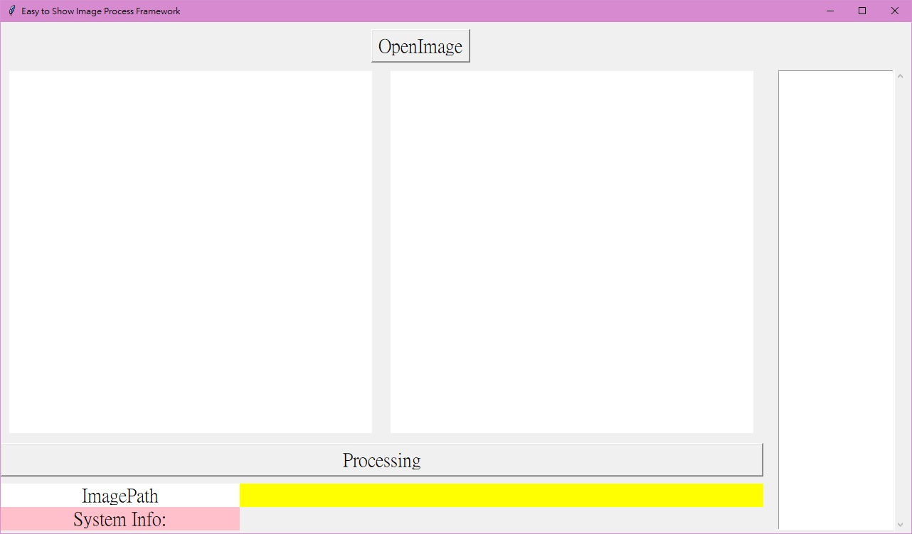

# E2SIPF
Easy to Show Image Process Framework

# English
## Environment
* python 3.6+
## PyPI Package
* Pillow 5.2 
## User guide
* Sept 1:
    # import
        import E2SIPF
* Sept 2:
    # Create UI object
        ui = E2SIPF.mainUi('Your UI title string')
* Sept 3:
    # Set run custom function 
        def example(ui,parameter):
            print(parameter)
        
    ## Note : if your function want get E2SIPF input image you can set ui parameter in your custom function input. 
* Sept 4: 
    # Set function in E2SIPF run button
        ui.setFunc(example)
    ## Note : set function name not string is function object
* Sept 5:
    # Set custom function input parameter in E2SIPF
        ui.setFuncPara(ui,'Hello World')
* Sept 6:
    # Show E2SIPF windows
        ui.show()
## About E2SIPF object function 
## .openImgUrl
    Get open image path
## .setOutputImag(imagearray)
    * Input image array
    Set process final image in E2SIPF window left canvas
    Note : only input uint8 array data type 
## .setOutputData(array)
    * Input array only
    Show your process parameter in E2SIPF window left

## About System Info
* There are show your custom function run time(second unit) and error message
## Example
### Image Conv Gray

#### This example program code in repositories,try it.